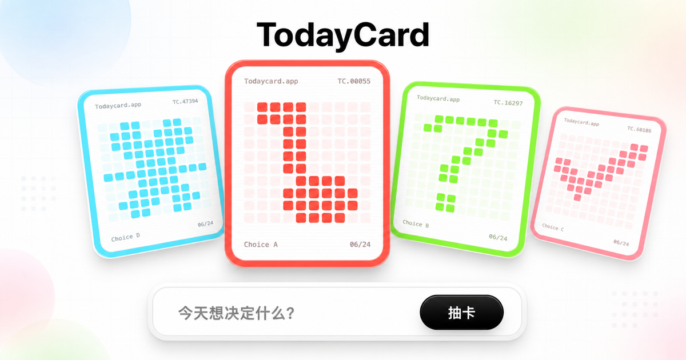

<p align="center">
  
</p>

<h1 align="center">TodayCard</h1>

<p align="center">
  
</p>

TodayCard 是一个极简 AI 决策卡片应用。用户只输入一个问题，系统生成 4 张可拖拽、可翻开的 seeded cards，把犹豫压缩成几个能行动的选择。

在线体验: [todaycard.app](https://todaycard.app/)  
源仓库: [github.com/hiyeshu/todaycard](https://github.com/hiyeshu/todaycard)

## 它做什么

- 单句输入: 只问“今天想决定什么？”
- 自动选项: 优先请求 `/api/cards`，失败时回退本地候选。
- 稳定卡片: `decision + option + index` 生成 seed，颜色、图案、选项编号可复现。
- 游戏化抽卡: 抽卡、逐张发牌、滑卡切牌、点击当前卡翻答案。
- 移动优先: 一屏 App Shell，牌堆独占触摸手势，避免滚动和翻牌打架。

## 本地运行

不需要安装依赖。构建只复制公开站点文件到 `dist/`。

```bash
npm run build
python3 -m http.server 4173 -d dist
```

打开 `http://localhost:4173`。这个预览会走本地候选；`/api/cards` 需要 Cloudflare Pages Functions 环境。

## Dify 接入

前端永远不保存 Dify Key。服务端代理在 `functions/api/cards.js`，只返回 `{ answers: string[] }`。

| 变量 | 默认值 | 用途 |
| --- | --- | --- |
| `DIFY_API_KEY` | 无 | 必填，Dify API Key |
| `DIFY_API_BASE_URL` | `https://api.dify.ai/v1` | Dify API 根地址 |
| `DIFY_INPUT_NAME` | `query` | workflow 输入字段名 |
| `DIFY_OUTPUT_NAME` | `answers` | workflow 输出字段名 |
| `DIFY_WORKFLOW_ID` | 空 | 只在使用 `/workflows/{id}/run` 时设置 |
| `DIFY_USER` | `todaycard-web` | Dify user 标识 |

## 部署边界

Cloudflare Pages 发布 `dist/`，Functions 从仓库根 `functions/` 读取。

```bash
npm run build
```

只允许公开这些站点资产: `index.html`、`styles.css`、`data.js`、`audio.js`、`app.js`、`robots.txt`、`sitemap.xml`、`site.webmanifest`、`assets/todaycard.svg`、`assets/og.png`。

`skills/`、`CLAUDE.md`、`AGENTS.md`、references 和其他 agent 文档只进仓库，不进站点。

## Skill 包

仓库根是应用，installable skill 是叶子目录:

```text
skills/todaycard/
```

本地检查:

```bash
npx skills@latest add . --list
```

目标是只发现一个 `todaycard` skill。单文件交付从 `skills/todaycard/assets/todaycard-single.html` 复制，不能反向替代 split source。

## 目录结构

```text
.
├── index.html              # 页面骨架和公开 SEO 元信息
├── styles.css              # 视觉、移动端一屏、coverflow、翻牌和发牌动效
├── data.js                 # palette、Choice A-D、10x10 图案数据
├── audio.js                # Web Audio 抽卡、发牌、切牌、翻牌音效
├── app.js                  # seeded card 数据、Dify 回退、交互状态机
├── functions/api/cards.js  # Dify 代理
├── assets/                 # favicon、OG 图、10x10 图案源
└── skills/todaycard/       # 可安装 Agent skill
```

## 开发铁律

- 改 split source 影响结构、视觉、交互、数据或默认文案时，同步 `skills/todaycard/assets/todaycard-single.html`。
- Dify 只生成 answers；seed、颜色、编号、日期和翻牌状态都留在 `app.js`。
- 图案源以 `assets/patterns.md` 为语义真相，`data.js` 必须同构。
- 同一组卡片不能重复色相家族，不能引入低明度脏色。
- 架构变更必须同步 `CLAUDE.md` / `AGENTS.md`，保持代码和文档同构。
